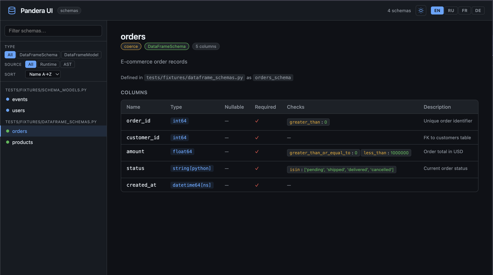

# pandera-ui

> **Swagger for your Pandera schemas.** One command — instant searchable documentation for every dataframe schema in your project.

[](https://pypi.org/project/pandera-ui/)
[](https://pypi.org/project/pandera-ui/)
[](https://github.com/Darius1223/pandera-ui/actions/workflows/ci.yml)
[](https://github.com/Darius1223/pandera-ui/blob/main/LICENSE)

---

## The problem

You have 30 Pandera schemas spread across a data project. New team members ask: *"Which columns does `OrdersSchema` have? Is `amount` nullable? What checks run on `user_id`?"*

The answer is buried in code. There's no docs page, no searchable index — just `grep` and hope.

## The solution

```bash
pip install pandera-ui
pandera-ui /path/to/myproject
```

pandera-ui scans your project, discovers every `DataFrameSchema` and `DataFrameModel`, and opens a **Swagger-like UI** at `http://localhost:8765`.



---

## Features

| Feature | Description |
|---|---|
| **Zero config** | Point at a directory, get a UI. No decorators, no config files. |
| **Two-pass extraction** | Runtime import for accuracy + AST fallback when imports fail. |
| **Live reload** | `--watch` reloads schemas automatically when `.py` files change. |
| **Export** | `--export markdown` / `--export html` for README embeds or Sphinx. |
| **Coverage** | `--coverage` shows what % of schemas and columns are documented. |
| **CI-friendly** | `--json` exports structured metadata for linting and diffing. |
| **Rich CLI** | Spinner and summary table when `rich` is installed. |
| **Fast navigation** | Filter by type, sort, full-text search. |
| **Team-ready** | Dark/light theme, EN/RU/FR/DE localization. |

---

## Quick install

=== "pip"

    ```bash
    pip install pandera-ui
    ```

=== "uv"

    ```bash
    uv add pandera-ui
    ```

=== "pip + extras"

    ```bash
    pip install pandera-ui[rich]    # terminal spinner + table
    pip install pandera-ui[watch]   # --watch mode
    ```

---

## Live demo

The pandera-ui UI itself is hosted at [**darius1223.github.io/pandera-ui/demo/**](./demo/) — preloaded with example schemas from the test suite. No installation needed.
